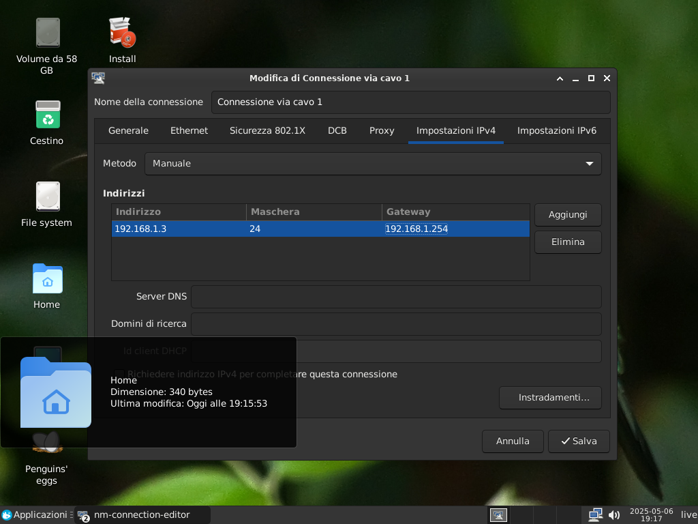
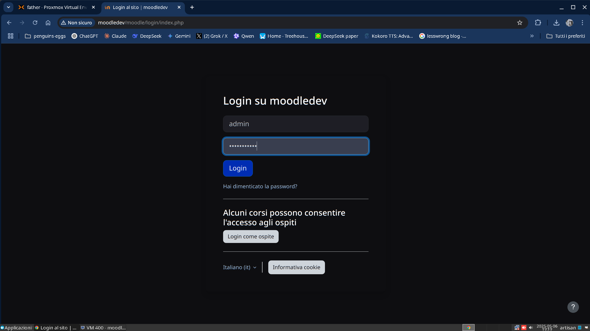

# README

La Moodle ISO Live `moodledev` è una semplice live Debian bookworm, adattata per lo sviluppo con moodle, la puoi trovare sul mio [googledrive](https://drive.google.com/drive/folders/18QIqicyecLMuU1Zmb2E039gWawzZuy3e?dmr=1&ec=wgc-drive-globalnav-goto), cerca `egg_of-debian-booworm-moodledev...` e scaricarla.

Avviata la live, potete utilizzarla così com'è, oppure installare il sistema utilizzando l'installer grafico calamares.

# User/password

* L'utente mariadb è `root/evolution`
* L'utente di phpmyadmin è `phpmyadmin/evolution`
* L'utente per moodle è: `admin/Evolution@1`
* La cartella `moodle` è sotto `/var/www/html`
* La cartella `moodledata` è sotto `/var/www/moodledata`

# Plugin modificati/in sviluppo

Sono inclusi, parzialmente funzionanti, i seguenti plugin:

* [moodle-local_boost_dark](https://github.com/pieroproietti/moodle-local_boost_dark)
* [moodle-local_confirm](https://github.com/pieroproietti/moodle-local_confirm)

# Utiizzo 
Questa immagine iso live può essere utilizzata così com'è all'interno di un virtualizatore [boxes](https://apps.gnome.org/en/Boxes/), [proxmox ve](https://pve.proxmox.com/wiki/Main_Page), [virtualbox](https://www.virtualbox.org/) o copiata all'interno di una chiavetta usb con [ventoy](https://www.ventoy.net/en/index.html).

Potete. infine masterizzarla su una chiavetta USB con strumenti come [balena etcher](https://etcher.balena.io/), [rufus](https://rufus.ie/it/) o similari.


La live è comodissima per fare test, ad ogni riavvio avremo un sistema pulito e scevro dai nostri esperimenti, ma questo non sempre è l'ideale. Con il passare del tempo se ne consiglia l'installazione, utilizzando l'installer GUI calamares.

## Impostazioni di rete
Avviate il computer direttamente dalla live, è possibile impostare l'ip della rete come manuale (esempio:`192.168.1.4/24` con gateway `192.168.1.254`.



e, se avete impostato sulla macchina host una riga in `/etc/hosts`
```
192.168.1.4    moodledev
```
Potete usarlo anche da questa, o da qualsiasi computer in rete che abbia impostato la risoluione per `moodledev`

## Login su moodledev
Aprite il vostro browser all'indirizzo: `http://moodledev/` e cliccate sul link [moode]


Non vi resta che eseguire il login con `admin/Evolution@1` e buona avventura!

# Guida sviluppo
[Developer Resource centre](https://moodledev.io/)
